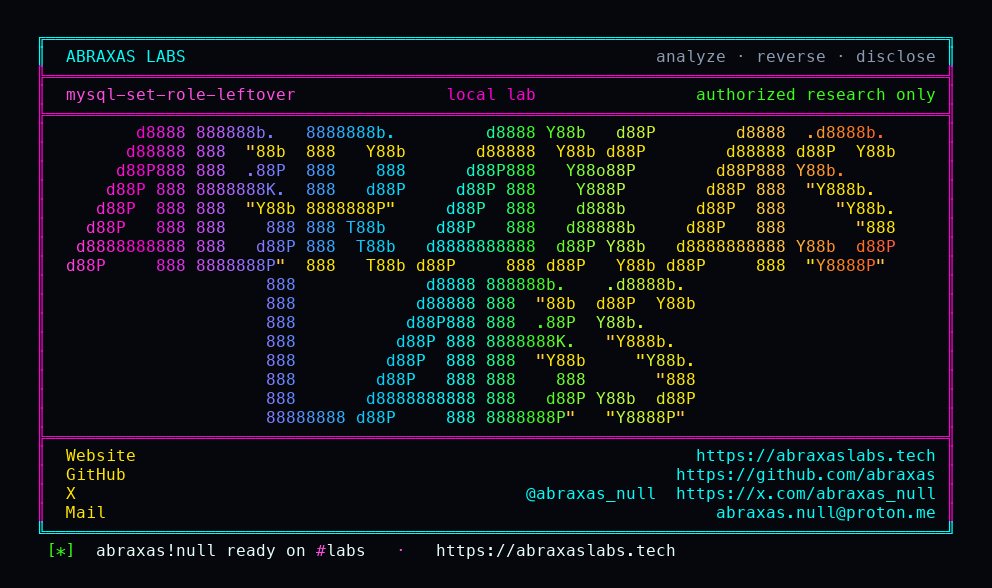

<p align="center">
  
</p>

<p align="center">
  <a href="https://abraxaslabs.tech"><strong>abraxaslabs.tech</strong></a>
  &nbsp;·&nbsp;
  <a href="https://github.com/abraxas">github.com/abraxas</a>
  &nbsp;·&nbsp;
  <a href="https://x.com/abraxas_null">@abraxas_null</a>
  &nbsp;·&nbsp;
  <a href="mailto:abraxas.null@proton.me">abraxas.null@proton.me</a>
  &nbsp;·&nbsp;
  <a href="https://github.com/abraxas/mysql-set-role-leftover">mysql-set-role-leftover</a>
</p>

# mysql-set-role-leftover

**Class:** Privilege leftover

**MySQL Community Server** `mysqld` `26.7.0` (`06a5c1c`) - Oracle

`SET ROLE ALL EXCEPT rfile` (or `SET ROLE DEFAULT` with no defaults) clears the active-role list, then `checkout_access_maps()` returns without `set_master_access(user->access)`. `CURRENT_ROLE()` is NONE. Static global bits that the role aggregated (FILE, PROCESS, SUPER, ...) stay in `m_master_access`. `check_access` reads that leftover. Lab: leftover FILE writes `INTO OUTFILE` as the mysqld UID.

`SET ROLE NONE` is the path that restores `ACL_USER::access`. Dynamic privileges (SYSTEM_USER) drop. DB-level leftover is already closed (Bug#35386565). Default accounts have no roles.

| | |
|---|---|
| ID | no CVE yet |
| Class | **Privilege leftover** (FILE write as mysqld UID; not OS LPE) |
| CWE | [CWE-269](https://cwe.mitre.org/data/definitions/269.html) |
| CVSS | **High: 8.1** `CVSS:3.1/AV:N/AC:L/PR:L/UI:N/S:U/C:H/I:H/A:N` |
| Product | [MySQL Community Server](https://github.com/mysql/mysql-server) `mysqld` |
| Affected | **26.7.0** (`06a5c1c99c377fc41b2eba1ea244e8b220bdc3c8`) |
| Auth | authenticated; victim is granted a role that carries static global ACLs (FILE in the lab) |
| License | [GNU Affero GPL v3.0](LICENSE) |
| Lab | `127.0.0.1` only. Witness file. Leftover FILE write. |

## What an attacker can do

Hold an account that was granted a role with FILE (or another static global bit). `SET ROLE` that role, then `SET ROLE ALL EXCEPT` it. `CURRENT_ROLE()` reports NONE. `SELECT 'witness' INTO OUTFILE` still writes as the mysqld UID under `secure_file_priv`.

An application that sandboxes with `SET ROLE ALL EXCEPT dangerous_role` or `SET ROLE DEFAULT` and then trusts `CURRENT_ROLE()` still has those static bits. `SET ROLE NONE` actually drops them.

The leftover does not grant FILE the account never held through a role. It fails to drop FILE after deactivation.

## How I found it

Same 26.7.0 hunt as the three client leftovers. Default daemon unpublished Crit/High was empty. ACL / roles still had this empty-role early return.

```c
void Security_context::checkout_access_maps(void) {
  if (m_acl_map != nullptr) {
    get_global_acl_cache()->return_acl_map(m_acl_map);
    m_acl_map = nullptr;
  }
  if (m_active_roles.size() == 0) return;
  // ...
}
```

`activate_role_all` (ALL EXCEPT) and empty `activate_role_default` call that checkout. `activate_role_none` then does `set_master_access(user->access)`.

Wrong turn already recorded: first leftover `SELECT note FROM lab.t INTO OUTFILE` returned 1142 (`db_acl()` cache 0). Constant `SELECT 'witness' INTO OUTFILE` is the FILE oracle.

## Lab

```bash
cd lab
./run.sh
```

Image `mysql:26.7.0`. Published `127.0.0.1:18630`. Role `rfile` has FILE. Victim has `GRANT SELECT ON lab.*` and `GRANT rfile`, `file_priv=N`, no default role. Login outfile 1227. `SET ROLE rfile` outfile ok. `SET ROLE ALL EXCEPT rfile` makes `CURRENT_ROLE()` NONE; leftover outfile writes `/var/lib/mysql-files/MYSQL-SET-ROLE-LEFTOVER-WITNESS`. `SET ROLE NONE` is 1227 again.

```text
SUCCESS mysql-set-role-leftover before-file=denied with-role=yes leftover-role=NONE leftover-file=yes after-none=denied dump=26.7.0 image=mysql:26.7.0 MYSQL-SET-ROLE-LEFTOVER-WITNESS
```

## The fix

When `m_active_roles` is empty, `checkout_access_maps()` should `set_master_access(user->access)` the way `SET ROLE NONE` already does. Empty ALL EXCEPT / DEFAULT should not keep the previous aggregated map.

## References

- [github.com/mysql/mysql-server](https://github.com/mysql/mysql-server) tag [mysql-26.7.0](https://github.com/mysql/mysql-server/tree/mysql-26.7.0) (`06a5c1c99c377fc41b2eba1ea244e8b220bdc3c8`)
- [`sql/auth/sql_security_ctx.cc`](https://github.com/mysql/mysql-server/blob/mysql-26.7.0/sql/auth/sql_security_ctx.cc) `checkout_access_maps`
- [`sql/auth/roles.cc`](https://github.com/mysql/mysql-server/blob/mysql-26.7.0/sql/auth/roles.cc) `activate_role_all` / `activate_role_none`
- Sibling packs: [abraxas/mysql-mysqldump-show-tables-overflow](https://github.com/abraxas/mysql-mysqldump-show-tables-overflow) · [abraxas/mysql-mysqldump-tab-path](https://github.com/abraxas/mysql-mysqldump-tab-path) · [abraxas/mysql-mysqlbinlog-raw-path](https://github.com/abraxas/mysql-mysqlbinlog-raw-path)
